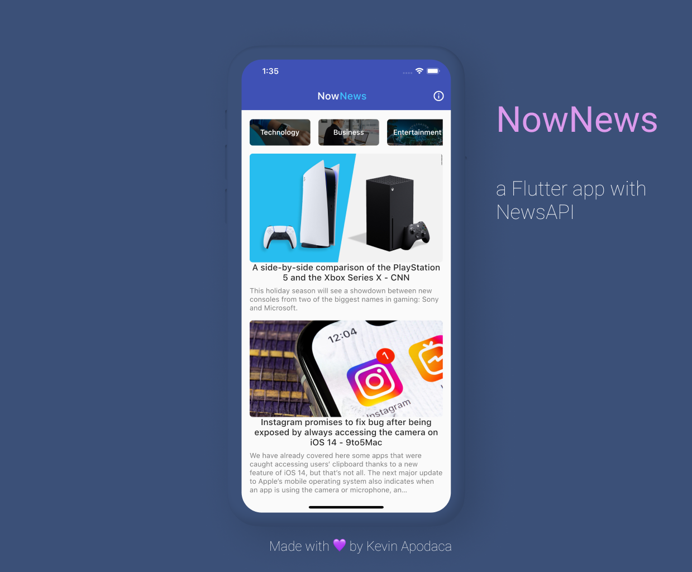

<h1 align="center"> NowNews </h1>  

  

  A simple News app, built with Flutter and News API.

## Introduction

This news app fetches the latest news using the News API and allows users to read the articles from within the app.

  

## Features

I implemented the following features to NowNews:

* Live updates / refresh
* Categories
* Web Views
* JSON Parsing
